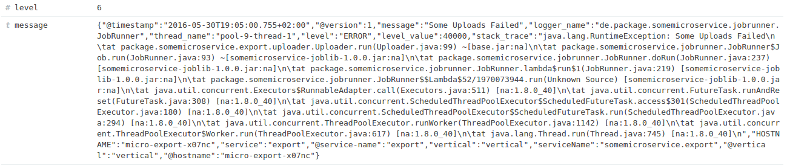

# Json-prettyprinter
chrome-extension to pretty print a selection of json directly inside the web page.

## Example
See this example log message from kibana

Select the whole json with the mouse

Click the icon  and be happy

## Installation:
Open chrome://extensions/ and click 'Load unpacked extensions'. Select the cloned repo path there.
The Extension is installed now until you disable or remove it.

## Usage:
1) Open a page with json.
2) Select it
3) click the awesome icon next to your address bar, labeled {p}

## Next steps:
* do something better than nothing, if no json at all or invalid json was selected
